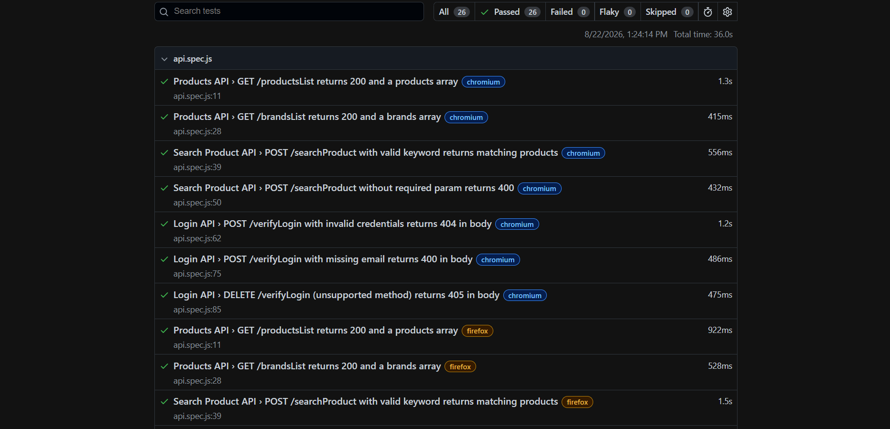
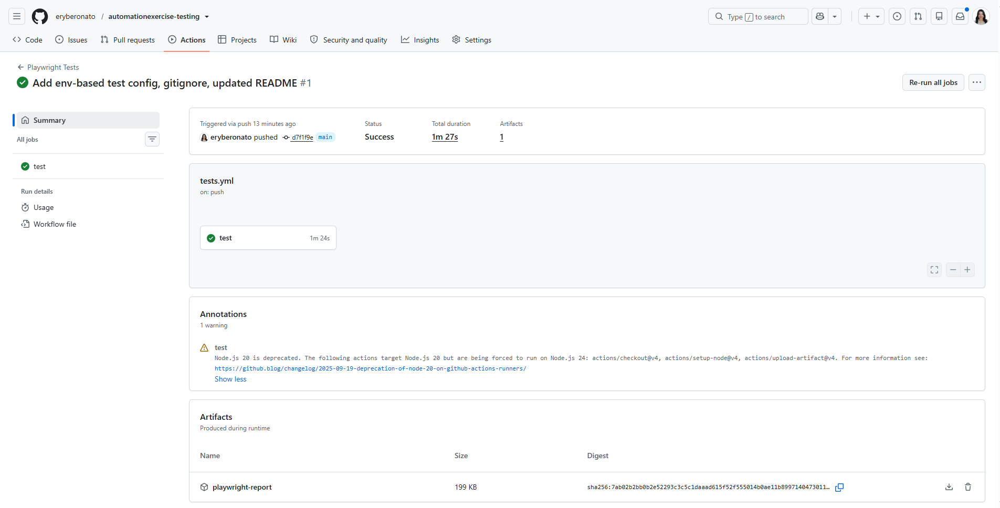

# AutomationExercise QA Automation

**Playwright | JavaScript | API Testing | CI/CD**

End-to-end QA automation project for [AutomationExercise.com](https://automationexercise.com), a
public e-commerce demo site. Covers both **UI automation** and **API testing**, built with the Page
Object Model pattern and run automatically on every push via GitHub Actions.

## Test coverage

**UI Testing**
- Login (valid / invalid credentials)
- Signup (duplicate email handling)
- Product search (with results / no results)
- Shopping cart (add / remove items)

**API Testing**
- Products list
- Brands list
- Product search (valid params / missing params)
- Login verification (valid / invalid / missing params / unsupported method)

## Test results

Latest local run — all tests passing across Chromium and Firefox:

| Test Type | Test Files | Status |
|---|---|---|
| UI | `login.spec.js`, `search.spec.js`, `cart.spec.js` | ✅ Pass |
| API | `api.spec.js` | ✅ Pass |
| **Total** | **4 spec files, 30 tests** | ✅ **30/30 passing** |

## Tech stack

- Playwright (Test Runner + API request context)
- JavaScript (Node.js)
- Page Object Model
- GitHub Actions (CI/CD)
- Playwright HTML Reporter

## Project structure

```
automationexercise-automation/
├── pages/                  # Page Object Model classes
│   ├── LoginPage.js
│   ├── ProductsPage.js
│   └── CartPage.js
├── tests/
│   ├── login.spec.js       # UI: invalid login, duplicate signup email
│   ├── search.spec.js      # UI: product search (positive + no-results)
│   ├── cart.spec.js        # UI: add/remove from cart
│   └── api.spec.js         # API: productsList, brandsList, searchProduct, verifyLogin
├── test-data/
│   └── test-data.json      # sample data for search keywords, login cases, API cases
├── docs/
│   ├── test-plan.md        # scope, environment, entry/exit criteria, risks
│   ├── test-scenarios.md   # high-level scenarios mapped to automation files
│   ├── test-cases.xlsx     # detailed manual test cases + API test cases
│   ├── bug-reports.md      # defect log (severity vs priority)
│   └── screenshots/
│       ├── playwright-report.png
│       └── github-actions.png
├── .github/workflows/
│   └── tests.yml           # CI pipeline
├── .env.example             # template for local test credentials (safe to commit)
├── .gitignore
├── playwright.config.js
├── package.json
└── README.md
```

## Setup

```bash
npm install
npx playwright install
```

### Environment variables

One test (`signup with an already-registered email`) needs a real, already-registered account on
the live site to correctly trigger the "already exist" error. Rather than hardcoding a personal
email in the test file, it's read from an environment variable:

```bash
cp .env.example .env
# then edit .env and set TEST_EMAIL to an email already registered on automationexercise.com
```

If `TEST_EMAIL` isn't set, that one test is automatically skipped (not failed) so the rest of the
suite still runs cleanly. `.env` is git-ignored and never committed.

## Running tests

```bash
npx playwright test              # run everything (UI + API)
npx playwright test tests/api.spec.js   # run only API tests
npx playwright test --ui         # interactive UI mode
npx playwright show-report       # view last HTML report
```

## Why API tests matter here

AutomationExercise.com exposes a public REST API (`/api/...`). Testing it directly — instead of only
through the UI — is faster, more reliable, and verifies backend behavior (status codes, error
messages, response shape) independent of frontend rendering. This project deliberately covers both
layers to show when UI testing is appropriate (user journeys) versus when API testing is more
efficient (data/backend validation).

## Test evidence

### Playwright HTML Report
26/26 tests passing across Chromium and Firefox — API tests (products, brands, search, login
verification) plus UI tests (login, search, cart).



### GitHub Actions CI Run
Tests run automatically on every push. Latest run: **Success**, 1m 27s, with the HTML report
uploaded as a downloadable artifact.



## Debugging note: a real flaky-test fix

The `remove product from cart` test initially failed intermittently. Root cause: cart item removal
on this site is AJAX-based (no full page reload), so the row count was being checked before the DOM
had actually updated. Fixed in `pages/CartPage.js` by waiting for the removed row to detach from the
DOM instead of using a fixed delay:

```js
async removeItemByIndex(index) {
  const rowToRemove = this.cartRows.nth(index);
  await this.deleteButtons.nth(index).click();
  await rowToRemove.waitFor({ state: 'detached' });
}
```

This is preferred over `page.waitForTimeout()` because it waits for the actual DOM condition rather
than an arbitrary fixed delay — faster on good runs, more reliable on slow ones.

## Related documentation

- [`docs/test-plan.md`](docs/test-plan.md) — scope, environment, entry/exit criteria, risks
- [`docs/test-scenarios.md`](docs/test-scenarios.md) — high-level scenarios mapped to automation files
- [`docs/test-cases.xlsx`](docs/test-cases.xlsx) — detailed manual UI + API test cases
- [`docs/bug-reports.md`](docs/bug-reports.md) — defect log with severity/priority classification, including screenshots
- [`docs/RTM_and_Execution_Report.xlsx`](docs/RTM_and_Execution_Report.xlsx) — requirements traceability matrix + test execution summary
