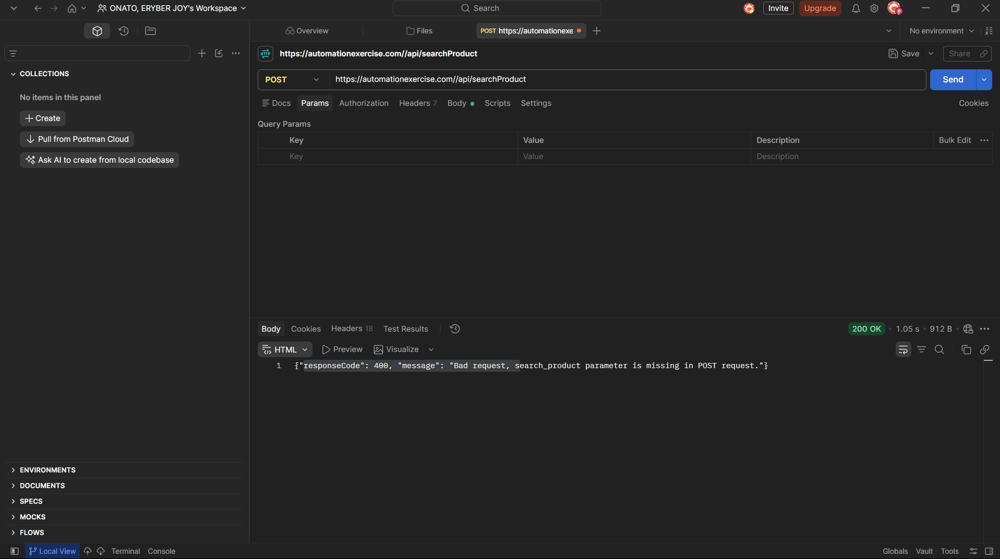
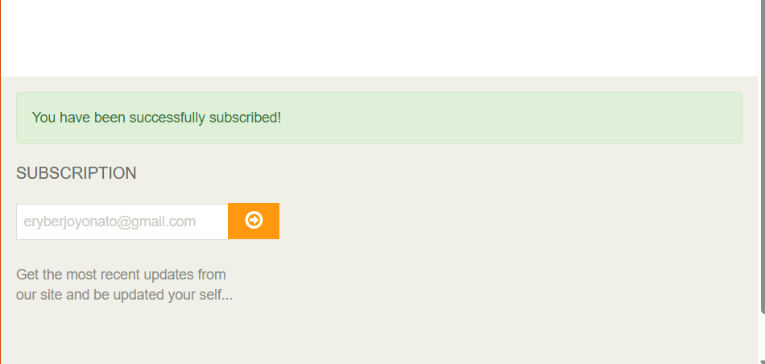
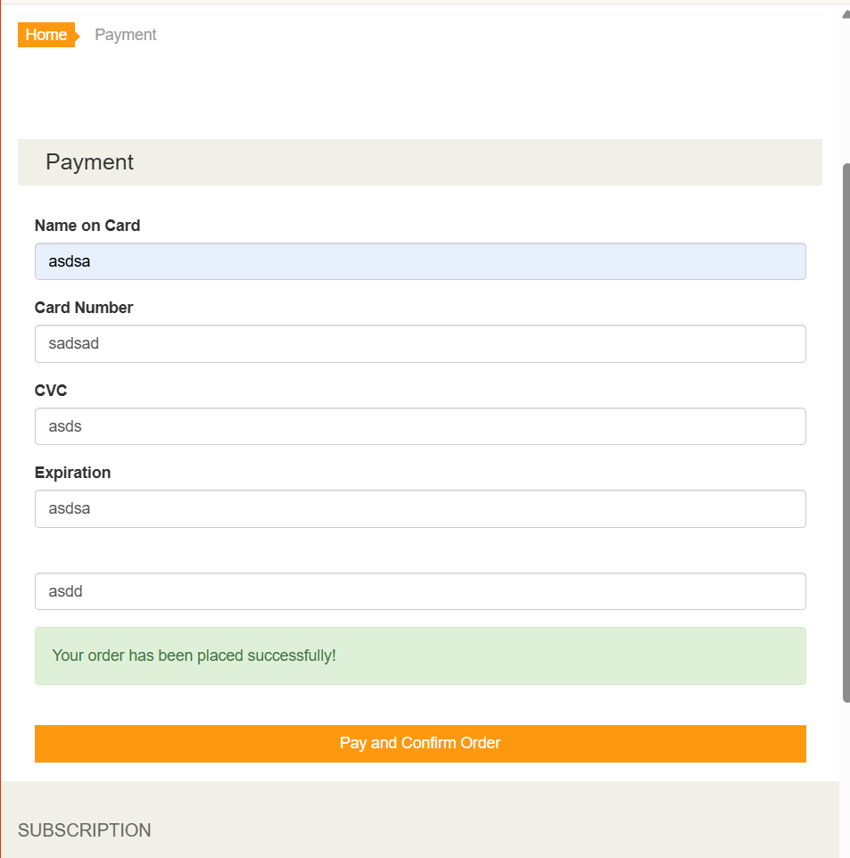

# Bug Report Log

Defects found during manual and automated testing of AutomationExercise.com. Each entry follows
a standard format: Severity (impact if it happened in production) vs Priority (urgency to fix).

---

## BUG-001

**Title:** Newsletter subscription accepts duplicate email without warning
**Reported By:** Eryber Joy Onato
**Date:** 2026-08-22
**Environment:** AutomationExercise.com — Chrome / Windows 11

**Severity:** Low
**Priority:** Low

**Preconditions:** Already subscribed once with the same email

**Steps to Reproduce:**
1. Go to the homepage footer
2. Enter an email address that has already been used for subscription
3. Click the subscribe arrow

**Expected Result:** System should show a message indicating the email is already subscribed

**Actual Result:** The same "You have been successfully subscribed!" message is shown again, with no duplicate check

**Screenshot/Evidence:**

**Status:** Open

---

## BUG-002

**Title:** API endpoints return HTTP 200 regardless of actual error condition
**Reported By:** Eryber Joy Onato
**Date:** 2026-08-22
**Environment:** AutomationExercise API (`automationexercise.com/api`)

**Severity:** Low
**Priority:** Low

**Preconditions:** None

**Steps to Reproduce:**
1. Send a POST request to `/api/searchProduct` without the `search_product` parameter
2. Inspect the HTTP response status code

**Expected Result:** HTTP status code should reflect the actual error (e.g. 400 Bad Request)

**Actual Result:** HTTP status remains 200, with the real error code (400) only embedded in the JSON response body's `responseCode` field — not surfaced as the actual HTTP status

**Screenshot/Evidence:**

**Status:** Open

---

## BUG-003

**Title:** Payment form accepts and processes orders with alphabetic characters in Card Number, CVV, and Expiry Date fields
**Reported By:** Eryber Joy Onato
**Date:** 2026-08-22
**Environment:** AutomationExercise.com — Checkout/Payment page

**Severity:** High
**Priority:** High

**Preconditions:** User has proceeded to checkout and reached the payment details form

**Steps to Reproduce:**
1. Go to the checkout payment page
2. Enter letters instead of numbers in the Card Number field (e.g. "abcdabcdabcdabcd")
3. Enter letters in the CVV field (e.g. "xyz")
4. Enter letters in the Expiry Date field
5. Click "Pay and Confirm Order"

**Expected Result:** Order should be rejected with a validation error, since card number, CVV, and expiry date must be numeric to represent valid payment information

**Actual Result:** Order is accepted and processed successfully despite invalid (non-numeric) payment details — no client-side or server-side validation catches the error

**Screenshot/Evidence:**

**Status:** Open

---

## Severity vs Priority reference

| | Low urgency | High urgency |
|---|---|---|
| **Low impact** | Priority: Low | Priority: Medium |
| **High impact** | Priority: Medium | Priority: High |

- **Severity** = how bad the bug is for the user/business (e.g. checkout completely broken = High/Critical)
- **Priority** = how soon it needs to be fixed relative to other work (e.g. a typo on a rarely-seen
  page = Low priority even if it's mildly embarrassing)

A bug can be **high severity, low priority** (a rare edge case that crashes the app but almost no
user hits it) or **low severity, high priority** (a visible typo on the homepage that stakeholders
want fixed immediately).

---

*Additional bug entries follow this same format as BUG-004, BUG-005, etc. See also
`docs/test-cases.xlsx` for a tabular version of this log, and
`docs/RTM_and_Execution_Report.xlsx` for how each bug traces back to a requirement and test case.*
